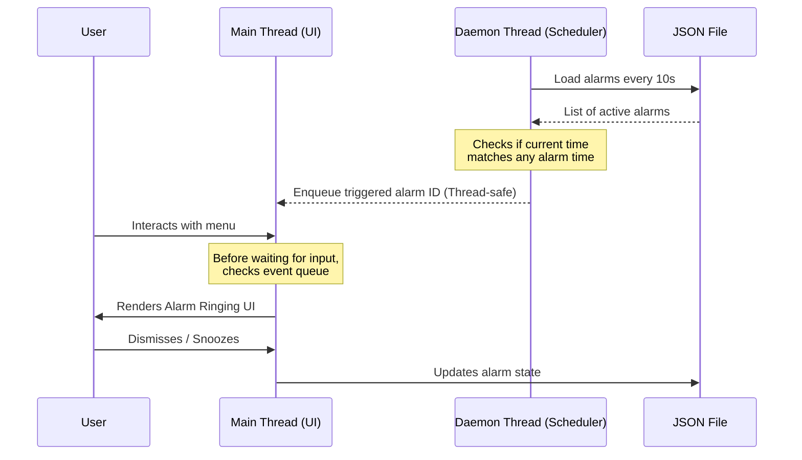

# Systems Design & Architecture: CLI Alarm Clock

## 1. Executive Summary
This document outlines the architectural decisions, trade-offs, and design patterns utilized in building the CLI Alarm Clock. The primary objective was to deliver a highly reliable, dependency-light, and robust background-scheduling tool with a clean terminal user interface (TUI).

## 2. Requirements & Product Alignment

Before implementation, several core product requirements were aligned upon to ensure the tool meets user expectations while remaining strictly bounded in scope:

- **State Persistence**: Alarms must survive application restarts. An in-memory only solution is insufficient for a real-world clock utility.
- **Concurrency**: The system must handle user input (CLI interactions) and asynchronous background events (alarms firing) simultaneously without race conditions or input garbling.
- **Dependency Minimization**: The tool should rely on the Python Standard Library as much as possible to ensure broad compatibility and reduce supply chain attack vectors.
- **Graceful Degradation**: Terminal interactions (ANSI colors, bells) must fail gracefully on older operating systems or non-TTY environments.

## 3. Architecture & Threading Model

The application utilizes a dual-thread architecture. Handling blocking I/O (like `input()`) on the main thread while managing time-based events in the background is notoriously tricky.

### The Threading Dilemma
If a background thread prints to `stdout` while the main thread is waiting on `stdin` (`input()`), the terminal buffer becomes corrupted and user experience degrades severely.

### The Solution: Event Queueing
Instead of the background thread preempting the main thread, it acts as a producer. When an alarm condition is met, the background thread enqueues an event into a thread-safe `_pending_rings` queue. The main thread, acting as the consumer, drains this queue between user interactions.



## 4. Data Persistence Strategy

**Format Chosen**: JSON Document (`~/.alarm_clock_data.json`)

**Trade-off Analysis**:
- *SQLite*: Offers robust querying and transactional safety, but is overkill for a dataset that rarely exceeds 10-20 items. Requires additional overhead.
- *JSON*: Human-readable, easily debuggable, and native to Python via the `json` module. Given the low write-frequency, atomic file replacements aren't strictly necessary for this scale, though file-locking would be a future enhancement for multi-process safety.

### Data Schema
```json
{
  "id": "a3f2b1c4",
  "time": "09:30",
  "label": "Daily Standup",
  "recurring": true,
  "created_at": "2023-10-25T08:00:00"
}
```
*Note: `time` is stored as an `HH:MM` string. Date context is intentionally omitted to allow implicit rollover for recurring alarms, reducing state-management complexity.*

## 5. Design Patterns Used

1. **Producer-Consumer Pattern**: Used between the scheduling daemon and the CLI interface to manage terminal I/O safely.
2. **In-Place Mutation (Snooze)**: Rather than building a complex state-machine for snoozed alarms, snoozing is handled by mutating the alarm's target time to `now() + 5m` and prepending a `Snoozed:` flag to the label. This leverages the existing alarm-check infrastructure without adding new edge cases.

## 6. Future Considerations & Scalability

If this tool were to be deployed to thousands of nodes, the following enhancements would be prioritized:
- **Atomic File Writes**: Writing to a temporary file and renaming it to prevent data corruption during a power failure mid-write.
- **Cross-Platform Audio**: Replacing the terminal bell (`\a`) with native OS audio APIs (e.g., `afplay` on macOS, `winsound` on Windows) for a richer user experience.
- **Daemonization**: Moving the background watcher to a true OS-level daemon (systemd/launchd) and having the CLI act merely as an IPC client.